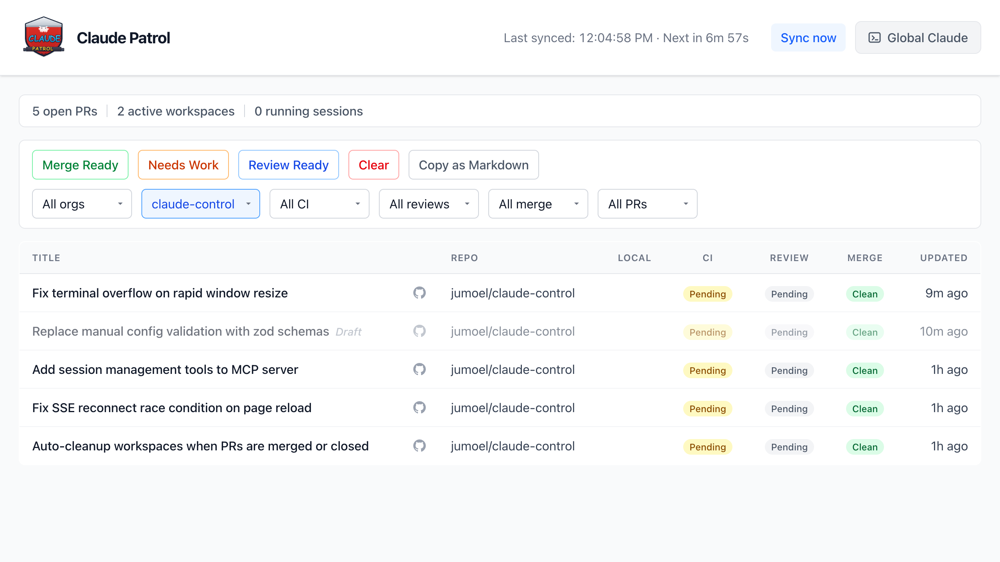

# Claude Patrol

A self-hosted PR monitoring dashboard that watches your GitHub orgs and repos, shows CI/review/merge status at a glance, and lets you spin up jj workspaces with embedded Claude Code terminal sessions. When something needs attention, you can dispatch Claude to investigate and fix it - all from one place.



## What it does

- **PR dashboard** - live-updating table of open PRs across your GitHub orgs and repos. Filter by org, repo, CI status, review state, merge readiness, draft. Quick filters for "Merge Ready", "Review Ready", and "Needs Work".
- **Workspace management** - create jj workspaces for any PR with one click. Supports per-repo symlinks, init commands, and Claude memory linking.
- **Terminal sessions** - embedded xterm.js terminals running Claude Code inside tmux. Multiple browser tabs or a native Ghostty window can share the same session. Pop out to Ghostty at any time.
- **Session transcripts** - Claude Code JSONL transcripts are archived when sessions end. View past conversations with searchable, structured output (tool calls, thinking blocks, results).
- **CI diagnostics** - view failed check logs inline, extract error context from GitHub Actions, retrigger failed checks.
- **MCP server** - exposes PR data, workspace ops, and CI logs as tools for Claude Code. Claude can triage PRs, create workspaces, and investigate failures autonomously.

## Prerequisites

You'll need these installed and on your PATH:

- **Node.js** >= 22 (uses `node:sqlite` built-in)
- **pnpm** - package manager
- **gh** - GitHub CLI, authenticated (`gh auth login`)
- **jj** - Jujutsu version control
- **claude** - Claude Code CLI
- **tmux** - terminal multiplexer (sessions survive server restarts)
- **Ghostty** (optional) - for the "Pop out" and "Terminal" buttons

## Getting started

```sh
$ git clone <repo-url> && cd claude-patrol
$ pnpm install
```

Create a `config.json` in the project root:

```json
{
  "poll": {
    "orgs": ["your-org"],
    "repos": ["owner/repo"],
    "interval_seconds": 600
  },
  "db_path": "./data/claude-patrol.db",
  "port": 3000,
  "workspace_base_path": "~/.claude-patrol/workspaces",
  "work_dir": "~/work",
  "global_terminal_cwd": "~/work"
}
```

Then start the server:

```sh
$ pnpm start
```

This builds the frontend and starts the server. Press space to open the dashboard in your browser, or pass `--open` to launch it automatically.

## Running in development

```sh
$ pnpm watch
```

This runs `vite build --watch` for the frontend and the backend server concurrently. The server's TUI (status bar, keyboard shortcuts) works normally. When you edit a backend `.js` file, the server restarts automatically with `--reattach` - active terminal sessions survive the restart and browser WebSockets reconnect.

## CLI

If you install globally (`pnpm install -g`), the `claude-patrol` command is available:

```sh
$ claude-patrol start [--open]   # build frontend, start server
$ claude-patrol stop             # graceful shutdown
$ claude-patrol status           # show running state and uptime
$ claude-patrol clean            # remove DB, PID file, MCP config
```

Running without a subcommand defaults to `start`.

## Configuration

| Field | Description |
|---|---|
| `poll.orgs` | GitHub organizations to monitor |
| `poll.repos` | Individual `owner/repo` entries to monitor |
| `poll.interval_seconds` | Polling interval (minimum 5s) |
| `db_path` | Path to the SQLite database file |
| `port` | Server port (auto-increments if in use) |
| `workspace_base_path` | Base directory for jj workspaces |
| `work_dir` | Base directory where your repos are cloned. Expects a `<org>/<repo>` structure (e.g. `~/work/acme/api-server`, `~/work/acme/webapp`). When creating jj workspaces, Claude Patrol resolves the main repo at `<work_dir>/<org>/<repo>`. |
| `global_terminal_cwd` | Working directory for the global terminal |
| `symlink_memory` | Create `.claude/memory` symlinks in workspaces |
| `repos.<org/repo>.symlinks` | Additional symlinks to create in workspaces |
| `repos.<org/repo>.initCommands` | Commands to run after workspace creation |

Config changes are picked up automatically - no restart needed.

## Rules

Declarative reactions to PR-state transitions and Claude session activity. Add a `rules` array to `config.json` and patrol fires actions when the trigger matches.

```json
{
  "rules": [
    {
      "id": "rebuild-on-green",
      "on": "ci.finalized",
      "where": {
        "repo": "myorg/api",
        "labels": ["needs-rebuild"],
        "ci_status": "pass",
        "draft": false
      },
      "actions": [
        { "type": "mcp", "tool": "retrigger_checks", "args": { "pr_id": "{{pr.id}}", "check_name": "lint" } },
        { "type": "dispatch_claude", "prompt": "PR {{pr.id}} just went green. Run the rebuild and report." }
      ],
      "cooldown_minutes": 10
    }
  ]
}
```

### Triggers (`on`)

- `ci.finalized` - all CI checks for a PR transitioned from non-final to final this poll cycle. Fires once per transition.
- `mergeable.changed` - a PR's mergeable status (`MERGEABLE` / `CONFLICTING` / `UNKNOWN`) just changed. Filter to the case you care about with `where: { mergeable: ... }`.
- `labels.changed` - one or more labels were added or removed on a PR. Use `where: { labels: ["foo"] }` to fire only when the label set still contains specific labels (e.g. "after `auto-merge` is added").
- `draft.changed` - a PR transitioned between draft and ready-for-review. Use `where: { draft: false }` for "ready-for-review" or `where: { draft: true }` for "moved back to draft".
- `session.idle` - a Claude session just emitted an `idle` state.

### Predicates (`where`)

Flat object, all keys must match (implicit AND). No nesting, no operators. For OR semantics, write multiple rules.

| Field | Trigger | Match form |
|---|---|---|
| `repo` (`org/repo`) | PR triggers | scalar or array |
| `org`, `branch`, `base_branch`, `author` | PR triggers | scalar or array |
| `ci_status` (`pass` / `fail` / `pending`) | PR triggers | scalar or array |
| `mergeable` (`MERGEABLE` / `CONFLICTING` / `UNKNOWN`) | PR triggers | scalar or array |
| `draft` | PR triggers | boolean |
| `labels` | PR triggers | array of strings, ALL must be present |
| `workspace_repo` | session.idle | scalar or array |

"PR triggers" means `ci.finalized` and `mergeable.changed` - both carry a PR context. `session.idle` only supports `workspace_repo`.

Invalid values (e.g. `ci_status: "success"`) are rejected at load time with a clear error.

### Actions

- `{ "type": "mcp", "tool": "<name>", "args": { ... } }` - calls any rule-fireable patrol tool. Read-only tools (`list_*`, `get_*`) are rejected at load time. Args support `{{pr.<field>}}` and `{{session.<field>}}` substitution before schema validation.
- `{ "type": "dispatch_claude", "prompt": "..." }` - resolves the PR's active workspace (creates one if missing), spawns Claude (waits for first idle), then writes the prompt. If the session is already mid-turn, the run errors with `session_busy` and cooldown retries on next trigger.

Actions run sequentially per rule. First failure stops the chain and marks the run `error`.

### Scoping

By default a rule auto-fires for any PR that matches its `where`. Two opt-out flags narrow the scope:

- `manual: true` - the rule never auto-fires. Only fires via `POST /api/rules/:id/run` (or the "Run now" button on the PR detail view). Use for one-off templates you fire deliberately.
- `requires_subscription: true` - auto-fires only for PRs explicitly subscribed via `POST /api/rules/:id/subscribe` `{ "pr_id": "..." }` or the toggle on the PR detail view. Subscriptions live in the local DB only - no GitHub state involved. Only valid for `ci.finalized` triggers (sessions are too ephemeral to subscribe to).
- `one_shot: true` - after a successful auto-fire, the subscription is automatically deleted. The user has to click "Arm" again on the PR to fire the rule once more. Failed runs leave the subscription intact so the next trigger gets another chance. Requires `requires_subscription: true`.

```json
{
  "id": "auto-retrigger-on-fail",
  "on": "ci.finalized",
  "where": { "ci_status": "fail" },
  "requires_subscription": true,
  "one_shot": true,
  "actions": [{ "type": "mcp", "tool": "retrigger_checks", "args": { "pr_id": "{{pr.id}}" } }],
  "cooldown_minutes": 30
}
```

With this rule, you open a PR, click "Arm" in the Rules section, and the next time that PR's CI finalizes as fail patrol retriggers the failed checks once. The button flips back to "Not subscribed" after the run completes - click Arm again if you want another retry.

A second example using the `mergeable.changed` trigger to auto-rebase a branch when GitHub reports it conflicting:

```json
{
  "id": "auto-rebase-on-conflict",
  "on": "mergeable.changed",
  "where": { "mergeable": "CONFLICTING", "draft": false },
  "requires_subscription": true,
  "one_shot": true,
  "actions": [
    {
      "type": "dispatch_claude",
      "prompt": "PR {{pr.id}} just transitioned to CONFLICTING. Run `jj git fetch`, then `jj rebase -d {{pr.base_branch}}@origin`. Resolve conflicts via `jj status` and `jj squash`. Run the project's test suite. If tests pass, `jj bookmark set {{pr.branch}} -r @` and `jj git push`. If tests fail, report what failed."
    }
  ],
  "cooldown_minutes": 60
}
```

Same Arm/Subscribe flow as above. Patrol creates the workspace if needed and waits for Claude to boot before sending the prompt.

### Lifecycle

- `cooldown_minutes` (default 10) - per `(rule_id, pr_id|session_id|workspace_id)` bucket. Prevents flapping CI from firing the same rule multiple times.
- Rules live-reload on `config.json` save. Invalid rules show in the Rules dropdown on the dashboard and as `WRN` lines in the TUI; valid rules keep firing.
- `rule_runs` rows persist; on server restart, mid-flight runs are reconciled to `status='error'` with `error='server_restarted'`.
- `rule_subscriptions` rows persist across restarts. If a subscribed PR is purged from the DB, the orphan row is harmless - the auto-fire path looks up the PR fresh and short-circuits if it's gone.

### Limitations

- Single-line prompts only. Multi-line through bracketed paste is not implemented.
- `dispatch_claude` is not allowed on `session.idle` triggers (loop trap). Use an `mcp` action instead.
- Two rules dispatching to the same workspace concurrently can interleave prompts. Cooldown bounds it.
- No multi-step workflows (`wait_for`, `branch`, `goto`). The triggers themselves are the wait primitives.

### Manual fire

`POST /api/rules/:id/run` with body `{"pr_id": "..."}` (or `{"session_id": "..."}`). Add `?force=true` to bypass cooldown.

### Bulk fire (run for all matching)

`POST /api/rules/:id/run-all` with body `{"subscribe": true}` fires the rule against every PR matching its `where` clause. For rules with `requires_subscription: true`, `subscribe: true` auto-subscribes the matching PRs first; without it, unsubscribed PRs are skipped. `force: true` bypasses cooldown and the subscription gate. Fires happen in parallel server-side; the response returns immediately with `{ fired: [{pr_id, run_id}], skipped: [{pr_id, reason}] }`.

Use case: "rebase every conflicted PR right now":
```sh
curl -X POST -H 'content-type: application/json' \
  http://localhost:3000/api/rules/auto-rebase-on-conflict/run-all \
  -d '{"subscribe": true}'
```

Same available from the dashboard PR detail view via "Run for all matching" next to each rule, or from inside a Claude session via the `run_rule_for_all_matching_prs` MCP tool ("ask Claude to fire X for everyone").

## Architecture

```
Browser (React + xterm.js)
    |
    |-- REST API (/api/prs, /api/workspaces, /api/sessions, ...)
    |-- SSE (/api/events) for live PR updates
    |-- WebSocket (/ws/sessions/:id) for terminal I/O
    |
Fastify server
    |-- Poller: gh api graphql -> SQLite
    |-- PTY manager: tmux sessions with node-pty bridge
    |-- Workspace manager: jj workspace create/destroy
    |-- MCP server: stdio transport for Claude Code
    |
SQLite (node:sqlite) -- prs, workspaces, sessions
```

**Backend**: Fastify 5, node:sqlite (DatabaseSync), node-pty, MCP SDK, zod.
**Frontend**: React 19, Vite 7, Tailwind CSS 4, xterm.js 6, TanStack Table.

No native database dependencies - `node:sqlite` is built into Node.js.

## API

**PRs**: `GET /api/prs` (filterable), `GET /api/prs/:id`, `GET /api/prs/:id/diff`, `GET /api/prs/:id/comments`, `GET /api/prs/:id/check-logs`

**Workspaces**: `POST /api/workspaces`, `GET /api/workspaces`, `GET /api/workspaces/:id`, `DELETE /api/workspaces/:id`, `POST /api/workspaces/:id/terminal`, `POST /api/workspaces/cleanup`

**Sessions**: `POST /api/sessions`, `GET /api/sessions`, `DELETE /api/sessions/:id`, `POST /api/sessions/:id/popout`, `GET /api/sessions/history`, `GET /api/sessions/:id/transcript`

**Rules**: `GET /api/rules`, `GET /api/rules/runs`, `POST /api/rules/:id/run`, `POST /api/rules/:id/run-all`, `GET /api/rules/:id/subscriptions`, `POST /api/rules/:id/subscribe`, `DELETE /api/rules/:id/subscribe`, `GET /api/prs/:pr_id/rule-subscriptions`

**Other**: `POST /api/sync/trigger`, `GET /api/config`, `GET /api/events` (SSE), `POST /api/checks/retrigger`

## MCP tools

When Claude Code connects via the auto-generated MCP config, it gets access to:

- `list_prs` - list and filter PRs
- `get_pr` / `get_pr_diff` / `get_pr_comments` - PR details
- `get_check_logs` - failed CI logs with error extraction
- `create_workspace` / `create_scratch_workspace` / `destroy_workspace` / `cleanup_workspaces` - workspace management
- `list_workspaces` - list workspaces with filtering
- `retrigger_checks` - re-run failed CI
- `wait_for_checks` - poll until CI checks reach a final state
- `trigger_sync` - force a GitHub poll

## License

ISC
